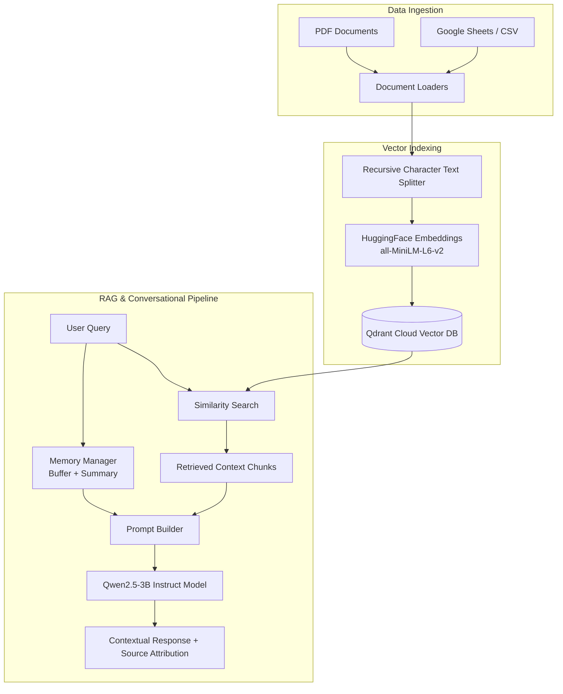

# 🧠 AI Knowledge Assistant with Conversational Memory (RAG Pipeline)

[](https://www.python.org/)
[](https://www.langchain.com/)
[](https://qdrant.tech/)
[](https://huggingface.co/Qwen/Qwen2.5-3B-Instruct)
[](LICENSE)

An enterprise-grade **Retrieval-Augmented Generation (RAG)** system designed to integrate heterogeneous knowledge sources (PDF documents and structured Google Sheets / CSV data), index them into **Qdrant Cloud**, and answer natural language queries using a local HuggingFace LLM (**Qwen 2.5-3B**) with multi-turn conversational memory.

---

## 🏗️ System Architecture



---

## ✨ Key Features

- **Multi-Source Data Integration:** Seamlessly ingests unstructured text (PDF lectures/reports) and structured data (housing prices / tables from Google Sheets).
- **High-Performance Vector Storage:** Utilizes **Qdrant Cloud** with `sentence-transformers/all-MiniLM-L6-v2` for ultra-fast semantic similarity retrieval.
- **Dual-Tier Conversational Memory:**
  - **Buffer Memory:** Retains exact recent conversation history for instant follow-up questions.
  - **Summary Memory:** Dynamically compresses older dialogue history into concise key facts to prevent context window overflow.
- **Strict Groundedness & Source Attribution:** Ensures answers are strictly derived from retrieved context while returning exact source metadata (e.g., PDF page, Sheet row).
- **Kaggle / Colab GPU Ready:** Fully optimized to run on T4 GPU environments with minimal latency.

---

## 📁 Repository Structure

```
.
├── AI_Knowledge_Assistant_with_Memory.ipynb  # Primary production notebook (Clean code)
├── Midterm_AI_Knowledge_Assistant.ipynb       # Full executed notebook with outputs & logs
├── Mid-term Project.pdf                      # Project assignment specifications & PDF data
├── requirements.txt                          # Production dependency specifications
├── .gitignore                                # Git exclusion configurations
└── README.md                                 # Project documentation
```

---

## 🚀 Quick Start Guide

### 1. Prerequisites & Installation

Clone the repository and install the dependencies:

```bash
git clone https://github.com/mo1gaber/AI_Knowledge_Assistant.git
cd AI_Knowledge_Assistant
pip install -r requirements.txt
```

### 2. Environment Configuration

The pipeline requires access to **Qdrant Cloud** for vector indexing. Set up the following environment variables (or add them via **Kaggle Secrets** / `.env`):

```bash
export QDRANT_URL="https://your-qdrant-cluster.cloud.qdrant.io"
export QDRANT_API_KEY="your-qdrant-api-key"
```

### 3. Running the Pipeline

Open the main notebook in Jupyter Notebook, VS Code, or Kaggle:

```bash
jupyter notebook AI_Knowledge_Assistant_with_Memory.ipynb
```

---

## 🧪 Evaluation & Testing Highlights

The pipeline includes automated tests evaluating:
1. **Factual Retrieval Accuracy:** Querying specific housing prices from tabular data.
2. **Domain Q&A:** Querying computer vision concepts from lecture slides.
3. **Conversational Memory:** Preserving user identity and context across 5+ dialogue turns.
4. **Hallucination Prevention:** Correctly reporting when requested information is absent from the knowledge base.

---

## 🛠️ Technology Stack

- **Orchestration:** LangChain Core, LangChain Community, LangChain Qdrant
- **Vector Database:** Qdrant Cloud Engine
- **Embeddings Model:** `sentence-transformers/all-MiniLM-L6-v2`
- **Large Language Model:** `Qwen/Qwen2.5-3B-Instruct`
- **Frameworks:** PyTorch, Transformers, Accelerate, Pandas, PyPDF

---

## 👤 Author

- **Mohamed Gaber** (`mo1gaber`) - [GitHub Profile](https://github.com/mo1gaber)
- **Email:** `modym8375@gmail.com`